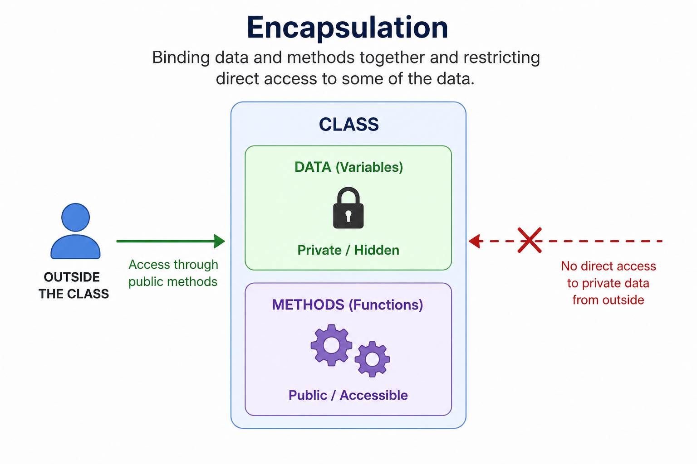

# OOP Interview Questions & Answers
> Please click⭐ If this repository helps you, please give it a star. Follow me on linkedIn [Abhishek Shrivastav](https://www.linkedin.com/in/abhi2249/) for technical updates.

---

## Why This Repository?

Most developers know the definitions of OOP concepts but struggle to explain them during interviews.

This repository focuses on:

✅ Simple definitions

✅ Real-world examples

✅ Interview-oriented answers

✅ Beginner to advanced questions

✅ Frequently asked questions from top companies

The goal is to help developers confidently answer OOP questions in technical interviews.

---

## Questions

1. [What is OOP?](#1-what-is-oop)
2. [Four Pillars of OOP](#2-four-pillars-of-oop)
3. [OOPs Concepts](#3-oop-concept)
4. [OOP Concepts Interview One-Line Definitions](#4-oop-concept-interview-one-line-definitions) 
5. [What is Abstraction](#5-what-is-abstraction)
6. [What is Encapsulation](#6-what-is-encapsulation)
7. [What is Inheritance](#7-what-is-inheritance)
8. [Types of Inheritance](#8-types-of-inheritance)
9. What is Single inheritance.
10. Multi-level inheritance.
11. Multiple inheritance.
12. Multipath inheritance.
13. Hierarchical Inheritance.
14. Hybrid Inheritance.
15. [What is Polymorphism](#15-what-is-polymorphism)
16. [What is Message Passing](#16-what-is-message-passing)
17. [What is Dynamic Binding (Late Binding)](#17-what-is-dynamic-binding-late-binding)
18. What is Static Binding
19. [Difference between Early Binding and Late Binding](#19-difference-between-early-binding-and-late-binding)
20. What is namespace ?
21. Explain access modifiers.
22. Explain constructor.
23. Explain Interface.
24. What are magic functions ?
25. What is static class and why we use it ?
26. Difference between this and self this ?
27. What are traits ?
28. What is final keyword ?
29. What is function overloading and overriding ?
30. Difference in interface and abstract class ?
31. What are design patterns ?
32. Types of design patterns


---

## 1. What is OOP?
Object-Oriented Programming (OOP) is a programming style that organizes code using objects, which contain data (properties) and behavior (methods).

## 2. Four Pillars of OOP
### a)  Abstraction
Data abstraction refers to the act of representing essential features without including the background detail or explanation.

**Example:**
We drive a car without thinking that how car subsystems is working.
```php
abstract class Vehicle
{
    abstract public function start();
}

class Car extends Vehicle
{
    public function start()
    {
        echo "Car Started";
    }
}
```

### b) Encapsulation
Wrapping data and methods into a single unit and controlling access.
```php
class BankAccount
{
    private $balance = 1000;

    public function getBalance()
    {
        return $this->balance;
    }
}

```
    
### c) Inheritance
Inheritance is the process by which one object acquires the properties of another class
```php
class Animal
{
    public function eat()
    {
        echo "Eating";
    }
}

class Dog extends Animal
{
}
```

### d) Polymorphism
Polymorphism means ability to take more the one form
```php
class Animal
{
    public function sound()
    {
        echo "Animal Sound";
    }
}

class Dog extends Animal
{
    public function sound()
    {
        echo "Bark";
    }
}
```

## 3. OOP Concept
There are 8 type of oop concept:
1. Object
2. Class
3. Encapsultion
4. Abstraction
5. Polymorphism
6. Inheritance
7. Message Passing
8. Dynamic Binding

### 4. OOP Concept Interview One Line Definitions

| Concept           | Definition                                                            |
| ----------------- | --------------------------------------------------------------------- |
| Object            | Instance of a class                                                   |
| Class             | Blueprint for creating objects                                        |
| Encapsulation     | Hiding data and controlling access                                    |
| Abstraction       | Hiding implementation details and showing essentials                  |
| Polymorphism      | Same method behaves differently                                       |
| Inheritance       | Acquiring properties and methods from another class                   |
| Message Passing   | Communication between objects by calling methods and exchanging data  |
| Dynamic Binding   | Deciding which method to execute at runtime instead of compile time   |


### 5. What is Abstraction

Data Abstraction is the process of showing only the essential features of an object and hiding the internal implementation details from the user.<br>
**or**<br>
Abstraction means exposing what an object does while hiding how it does it<br>
**Example:** You know **how to drive the car**, but you don't know **how the engine works internally**. That's Abstraction.

### 6. What is Encapsulation

Encapsulation is the process of wrapping data and methods into a single unit (class) and restricting direct access to data using access modifiers like private, protected, and public.<br>
**or**
Encapsulation means hiding data inside a class and allowing access to it only through methods<br>
<div>
<p align="center">
    
</p>
</div><br>

**Example:** 
```php
class Employee
{
    private $salary;

    public function setSalary($salary)
    {
        if ($salary > 0) {
            $this->salary = $salary;
        }
    }

    public function getSalary()
    {
        return $this->salary;
    }
}

$employee = new Employee();
$employee->setSalary(50000);

echo $employee->getSalary(); // 50000
```
Here, the salary cannot be modified directly:
```php
$employee->salary = -10000; // Error
```
Instead, it must go through setSalary(), which can validate the value before storing it. This is encapsulation.

### 7. What is Inheritance

Inheretence is the process in which object one class acquire the property of object of another class.

**Example:** 
```php
class Parents implements Info
{

	function __construct()
	{
		return "Parent Class Constructor</br>";
	}

	public function firstname()
	{
		return "The father name is rakesh";
	}

	function lastname($lname)
	{
		return " ".$lname."<br>";
	}
}

class Childs extends Parents
{
	function __construct()
	{
		return "Child Class Constructor</br>";
	}

	public function firstname()
	{
		return "The son name is harry";
	}
}


$pobj = new Parents();
$cobj = new Childs();

echo $pobj->firstname();
echo $pobj->lastname('tiwari');

echo "<br><br>";
echo $cobj->firstname();
echo $cobj->lastname('tiwari');
```

### 8. Types of Inheritance

1) Single inheritance.<br>
2) Multi-level inheritance.<br>
3) Multiple inheritance.<br>
4) Multipath inheritance.<br>
5) Hierarchical Inheritance.<br>
6) Hybrid Inheritance.<br>

**Note:** multiple inheritence is not support by php so we use interface.


### 15. What is Polymorphism

polymorphism ability to take more than one form

**Example:**

```php
class Shap
{
	public function draw(){

		echo "</br>this is a draw";
	}
}

class Circle extends Shap
{

	public function draw()
	{
		echo "This is a Circle";
	}
}

class Rectangle extends shap
{
	 public function draw()
	 {
	 	echo "</br>This is a Rectangle";
	 }
}

class Triangle extends shap
{
	public function draw()
	{
		echo "</br>This is Triangle";
	}
}

$val = array(3);

$val[0] = new Circle();
$val[1] = new Rectangle();
$val[2] = new Triangle();
$val[3] = new Shap();

for($i=0;$i<=3;$i++)
{
	$val[$i]->draw();
}
```

### 16. What is Message Passing

Message passing is a mechanism by which objects communicate with each other. An object sends a message (method call) to another object requesting it to perform a specific operation. The receiving object executes the corresponding method and may return a result.
**or**
Message passing means calling a method of an object to request a service or action.

```php
class Calculator
{
    public function add($a, $b)
    {
        return $a + $b;
    }
}

$calc = new Calculator();

// Sending a message to the object
$result = $calc->add(10, 20);

echo $result; // 30
```

**Here:** <br>

 $calc is an object.<br>
 add(10, 20) is the message being sent.<br>
 The object receives the message and executes the add() method. <br>

### 17. What is Dynamic Binding (Late Binding)

Dynamic Binding is the process of deciding which method to execute at runtime based on the actual object type.

```php
class Animal
{
    public function sound()
    {
        echo "Animal makes a sound";
    }
}

class Dog extends Animal
{
    public function sound()
    {
        echo "Dog barks";
    }
}

$animal = new Dog();
$animal->sound();
```

**Output:** Dog barks <br>

**What Happened?** <br>

```php
$animal = new Dog();
```
<ul>
<li>The reference variable is $animal.</li>
<li>The actual object created is Dog</li>
</ul>

 When: <br>
 $animal->sound(); is executed, PHP checks the actual object type (Dog) at runtime and calls: <br>
 Dog::sound() <br>
 This is **Dynamic Binding**.<br>
 **Reason:** Because the method call is resolved dynamically during execution, based on the actual object, rather than being fixed beforehand.


### 19. Difference between Early Binding and Late Binding

**Static Binding** means the method to execute is decided before execution (compile/parse time), while **Dynamic Binding** means the method to execute is decided during runtime based on the actual object type. Dynamic binding supports method overriding and runtime polymorphism.

| Static Binding (Early Binding)                 | Dynamic Binding (Late Binding)                  |
| ---------------------------------------------- | ----------------------------------------------- |
| Resolved at compile time                       | Resolved at runtime                             |
| Method to call is decided before program runs. | Method call is decided while program is running |
| Used for non-overridden methods                | Used for overridden methods                     |
| Faster                                         | Slightly slower due to runtime lookup           |
| Used when method is not overridden             | Used with method overriding and inheritance     |